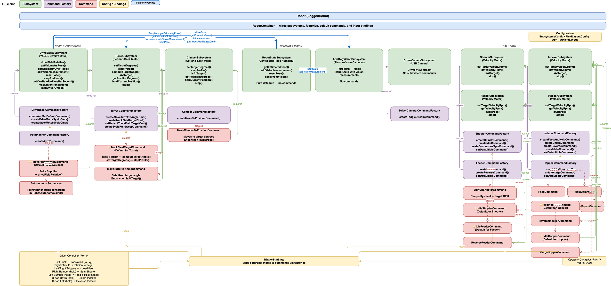

# 2026-frc-rebuilt

Robot software for the Ludington O-Bots 7160, powering our 2026 FIRST Robotics
Competition "REBUILT" season codebase.

## Contents

- [2026-frc-rebuilt](#2026-frc-rebuilt)
  - [Contents](#contents)
  - [Prerequisites](#prerequisites)
  - [Getting started](#getting-started)
  - [Build and test](#build-and-test)
  - [Simulation](#simulation)
  - [Persisting tuned values](#persisting-tuned-values)
    - [One-time setup](#one-time-setup)
    - [Usage](#usage)
    - [Valid subsystem keys](#valid-subsystem-keys)
    - [How it works](#how-it-works)
    - [Known limitations](#known-limitations)
  - [Deployment](#deployment)
  - [Documentation](#documentation)
    - [For other teams](#for-other-teams)
  - [Development reference](#development-reference)
    - [Project structure](#project-structure)
    - [Pose ownership](#pose-ownership)
    - [Dependencies](#dependencies)

## Prerequisites

1. **Install [Git for Windows](https://git-scm.com/download/win)** if you are on
   Windows. This is required to clone the repository and manage code. (macOS
   users already have Git pre-installed.)
2. **Install the
   [WPILib 2026 release](https://docs.wpilib.org/en/stable/docs/zero-to-robot/step-2/wpilib-setup.html)**
   (bundles Java 17, GradleRIO, and the VS Code extensions). Ensure the WPILib
   command-line tools are on your `PATH`.
3. **Install
   [PathPlanner](https://pathplanner.dev/gui-getting-started.html#install-pathplanner)**
   for trajectory authoring and visualization.
   - macOS: install it into the current season’s WPILib folder under a
     pathplanner subfolder.
   - macOS: if you see a malware warning, allow it via System Settings → Privacy
     & Security → Open Anyway, or run `sudo xattr -rd com.apple.quarantine`
     followed by the PathPlanner app folder.
4. **Install [Node.js](https://nodejs.org/)** (LTS recommended) for draw.io
   tooling in this repo, including MCP-based diagram editing and export scripts.
   - Verify the install with `node -v`.

## Getting started

1. **Clone the repository** (see GitHub's guide on
   [cloning a repository](https://docs.github.com/en/repositories/creating-and-managing-repositories/cloning-a-repository)
   for step-by-step instructions) and let WPILib import vendordep JSON files
   automatically when you first open the project.
2. **Open the repo folder using the WPILib-installed VS Code** (the WPILib build
   of VS Code is required; standard VS Code will not have the WPILib extensions
   and dependencies bundled).
3. **Install the recommended extensions** when VS Code prompts you. If you don’t
   see a “Recommended” view, open the Command Palette (**Ctrl+Shift+P** or
   **Cmd+Shift+P**), run **“Extensions: Show Recommended Extensions”**, and
   install the workspace recommendations (the WPILib VS Code bundle provides the
   FRC extensions needed for builds and simulation).

## Build and test

1. **Build and test locally** to verify the code compiles and unit tests (if
   present) pass:
   - Terminal: run `./gradlew build`.
   - WPILib Command Palette: run **“WPILib: Build Robot Code”**.
   - Keyboard shortcuts: press **Ctrl+Shift+B** (Windows/Linux) or
     **Cmd+Shift+B** (macOS).

## Simulation

1. **Launch the simulator** to exercise subsystems and commands without
   hardware:
   - Terminal: `./gradlew simulateJava`.
   - WPILib Command Palette: **“WPILib: Simulate Robot Code”**.
2. **Use the WPILib simulator UI** to view NetworkTables, control inputs, and
   AdvantageKit logs while iterating.

## Persisting tuned values

When tuning PID gains, motion profiles, or other config values live through
Elastic or AdvantageScope, the changes exist only in NetworkTables and are lost
when the robot restarts. The `persist-tuned-values` script reads the current
values from the running NT4 server and patches the local `subsystems.json` so
changes survive a redeploy.

### One-time setup

```bash
cd scripts && npm install
```

### Usage

Convenience npm scripts are provided in `scripts/package.json`:

| Script                 | Target                       | Config file            |
| ---------------------- | ---------------------------- | ---------------------- |
| `npm run persist:prod` | Production robot (team 7160) | `subsystems.json`      |
| `npm run persist:test` | Test robot (team 7160)       | `subsystems-test.json` |
| `npm run persist:sim`  | Simulator (localhost)        | `subsystems-sim.json`  |

Append extra flags after `--`:

```bash
# Preview changes from the simulator without writing
npm run persist:sim -- --subsystem turretSubsystem --dry-run

# Persist turret changes from the production robot
npm run persist:prod -- --subsystem turretSubsystem

# Watch mode — monitor changes live, press Enter to persist
npm run persist:sim -- --watch --subsystem turretSubsystem
```

You can also call the script directly:

```bash
node scripts/persist-tuned-values.mjs --team 7160 --subsystem turretSubsystem
```

### Valid subsystem keys

Use the top-level keys from `subsystems.json`:

`driveBaseSubsystem`, `turretSubsystem`, `shooterSubsystem`, `indexerSubsystem`,
`robotPoseSubsystem`, `aprilTagVisionSubsystem`, `driverCameraSubsystem`,
`climberSubsystem`, `feederSubsystem`, `intakeSubsystem`, `harvesterSubsystem`,
`triggerBindings`

### How it works

The robot publishes config values to NetworkTables under two namespaces:

- **System 2 (preferred):**
  `AdvantageKit/NetworkInputs/SmartDashboard/<ClassName>/<field>` — created
  lazily by `AbstractConfig.readTunableNumber` via AdvantageKit's
  `LoggedNetworkNumber`. This is the namespace Elastic edits live.
- **System 1 (fallback):** `SmartDashboard/SubsystemsConfig/<json/path>` —
  seeded at startup by `ConfigurationLoader.iterateFields`. Mirrors the JSON
  structure exactly.

The script connects via the NT4 WebSocket protocol, reads all SmartDashboard
topics for the specified subsystem (including nested motor configs), checks
System 2 first and falls back to System 1, then compares against the JSON file
and writes back only the fields that changed. Non-tunable fields like CAN IDs,
motor inversion, and enabled flags are never modified unless they were edited in
Elastic.

In **watch mode** (`--watch`), the script stays connected and polls every 2
seconds. When changes are detected it displays them; press Enter to persist or
keep tuning. It automatically reconnects if the robot or simulator restarts.

### Known limitations

- **Disabled subsystems**: If a subsystem is disabled, its getters may never
  run, so System 2 keys won't exist. The script falls back to System 1 keys
  (startup seed), which still reflect any edits made in Elastic at that level.
- **FMS mode**: Tunables are not created when the Field Management System is
  attached, so the script only works in practice or simulation.
- **Class-name collisions**: If two nested configs share the same Java class
  name (e.g., a leader and follower motor using the same `MotorConfig` type),
  their System 2 keys collide. The script cannot distinguish them and will apply
  the value from NT to both JSON entries. Use distinct config classes to avoid
  this.

## Deployment

1. **Connect to the robot** so the roboRIO is reachable:
   - USB tether from the laptop to the roboRIO (fastest for pits).
   - Ethernet from the laptop to the field/test router (wired is preferred for
     reliability).
   - Team Wi‑Fi (ensure you’re on the robot or practice network and have good
     signal).
2. **Deploy using one of these options** (all run the same GradleRIO deploy
   target):
   - Terminal: `./gradlew deploy`.
   - WPILib Command Palette: **“WPILib: Deploy Robot Code”**.
   - Keyboard shortcut: press **F5** in the WPILib-installed VS Code.
3. **After deployment, bring up your tools to drive and monitor telemetry:**
   - Open the FRC Driver Station to enable the robot and map
     joysticks/controllers.
   - Launch Advantage Scope to visualize logs and signals.
   - Open the Elastic dashboard to watch live telemetry and key widgets.

## Documentation

In-repo Markdown files are rendered as styled HTML pages when you run
`./gradlew javadoc`. The generated site appears under `build/docs/javadoc/` and
is published to GitHub Pages so students and mentors can browse without cloning
the repo.

Key starting points:

- [Glossary](src/main/java/frc/robot/GLOSSARY.md) – definitions of robotics and
  programming terms used throughout the codebase.
- [Subsystems index](src/main/java/frc/robot/subsystems/README.md) – folder
  layout, inheritance hierarchy, and links to every mechanism.
- [Shared abstractions](src/main/java/frc/robot/shared/README.md) – the abstract
  base classes, the set-and-seek pattern, and the disabled-subsystem lifecycle.

### For other teams

This repository is public. You are welcome to read, learn from, and adapt any of
the code or documentation. If you have questions, open a GitHub Issue and we
will do our best to help. Please note that the hardware configuration
(`subsystems.json`, swerve configs, CAN IDs) is specific to our robot — you will
need to adjust those values for your own machine.

## Development reference

### Project structure

The key folders under `src/main` you will touch most often are:

- `deploy/` – JSON configs and paths the robot loads at startup, including
  `subsystems.json` and swerve module/controller settings.
- `java/frc/robot/BuildConstants.java` – build metadata (git hash, compile time,
  etc.) injected by Gradle for on-robot diagnostics.
- `java/frc/robot/devices/` – reusable device wrappers like controllers.
- `java/frc/robot/shared/` – cross-cutting pieces many mechanisms share:
  - `bindings/` for trigger/input helpers.
  - `commands/` for abstract command bases.
  - `config/` for shared config types/loaders.
  - `logging/` for AdvantageKit and telemetry helpers.
  - `subsystems/` for abstract subsystem bases.
  - `field/` for field-target selection helpers.
- `java/frc/robot/subsystems/<mechanism>/` – concrete mechanism code, each with
  its own `commands/` (including command factories), `config/`, and `io/`
  folders.

### Pose ownership

- `RobotPoseSubsystem` is the authoritative field pose source for commands and
  other subsystems.
- `DriveBaseSubsystem` provides odometry only and streams updates into the pose
  subsystem.
- Resetting pose flows through the pose subsystem so the drivebase and estimator
  stay aligned.



This architecture diagram lives in `assets/7160-frc-rebuilt.drawio.svg`; open
and edit it with [draw.io](https://www.drawio.com/download) to keep the visuals
current as the robot evolves.

### Dependencies

All third-party libraries live in `vendordeps/` and are versioned alongside the
code so WPILib will automatically pull the right artifacts:

- **AdvantageKit** – provides deterministic telemetry logging and replay so we
  can diagnose the robot off-field.
- **WPILib New Commands** – keeps the declarative command-based framework
  separate so we can stay current with WPILib updates.
- **PathPlannerLib** – supplies the PathPlanner runtime library for autonomous
  path following, path loading, and holonomic control helpers.
- **YAGSL (Yet Another Generic Swerve Library)** – manages the swerve drive
  kinematics, control loops, and auto pathing layers for the drivetrain.
  - **CTRE Phoenix 5 & 6** – covers Talon SRX/Victor SPX legacy controllers (v5)
    plus Talon FX/CANcoder/Pigeon2 devices (v6) used throughout the drivetrain
    and mechanisms.
  - **REVLib** – interfaces with Spark MAX motor controllers, NEO brushless
    motors, and REV sensors used on manipulators.
  - **StudicaLib** – adds support for the Studica control interface hardware
    that powers our custom operator panel.
  - **ThriftyLib** – supplies device wrappers for ThriftyBot sensors (such as
    absolute encoders and power modules) integrated into this robot.

These vendordeps are committed so the correct versions ship with every build,
ensuring sim, practice, and competition robots stay in sync.
