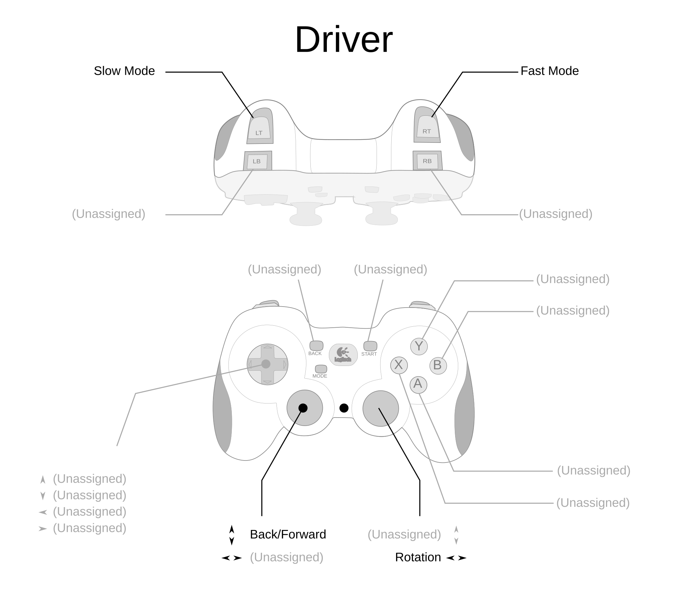
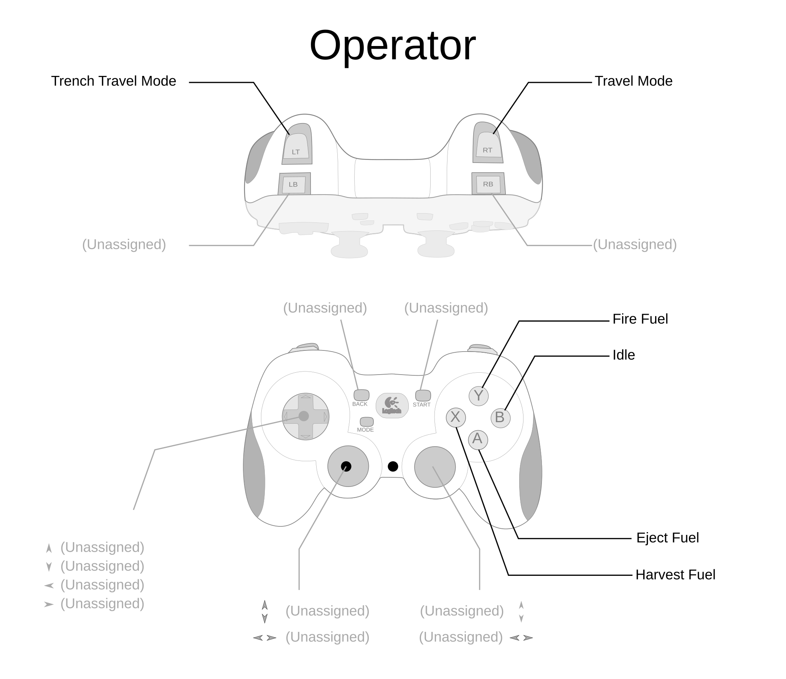

# Trigger Bindings

This package maps physical controller inputs to robot commands so
`RobotContainer` stays lean. All bindings live in `TriggerBindings`; tunable
parameters (response curves, speed scales, deadbands) live in
`TriggerBindingsConfig`.

## Controllers

The robot uses two Logitech F310 controllers (XInput mode) connected via USB:

| Port | Role     | Primary responsibility                     |
| ---- | -------- | ------------------------------------------ |
| 0    | Driver   | Driving, speed tiers                       |
| 1    | Operator | Gameplay state transitions (fire, harvest) |

## Driver controller layout

The driver controller handles field-relative driving and speed management:

- **Left stick** — translation (Y = forward/back, X = strafe).
- **Right stick X** — rotation (omega).
- **Right trigger** — sprint (100 % max speed).
- **Left trigger** — slow/precision mode (40 % max speed).
- No trigger held — normal speed (80 % max speed).

Each axis passes through a configurable response curve
(`leftStickYResponseExponent`, `leftStickXResponseExponent`,
`rightStickXResponseExponent`) and a joystick deadband before the speed scale is
applied.

## Operator controller layout

The operator controller manages gameplay state transitions:

| Input         | Action                        |
| ------------- | ----------------------------- |
| Right trigger | Enter **FIRE_READY** state    |
| Left trigger  | Enter **HARVEST_READY** state |
| Start button  | Enter **CLIMB_READY** state   |
| B button      | **EJECT** (active while held) |
| Y button      | Return to **IDLE**            |

Triggers use `onTrue` so the state change persists after the button is released.
The B button uses `whileTrue` because ejecting should stop as soon as the
operator lets go.

## Tuning mode

When `tuningEnabled` is set to `true` in `TriggerBindingsConfig`, the driver
controller switches to subsystem test mode:

- A dashboard chooser (`TriggerBindings/TestSubsystem`) selects which subsystem
  is under test (Shooter, Indexer, Feeder, Intake, Turret, or Harvester).
- **A button** — reverse / move to minimum setpoint.
- **B button** — forward / move to maximum setpoint.
- **X button** — run a full SysId characterization sweep (~60 seconds).

Default commands are not registered in tuning mode so mechanisms stay wherever
the test commands leave them.

## Controller health monitoring

`TriggerBindings.checkControllerHealth()` runs once per robot loop (wired
through `RobotContainer.periodic()`). It performs two checks per controller:

1. **Connection check** — Uses `DriverStation.isJoystickConnected()` and fires a
   `DriverStation.reportWarning()` once when a controller transitions from
   connected to disconnected.
2. **Stale-input detection** — During teleop, tracks whether any axis on the
   controller has been non-zero. If the controller reports as connected but all
   axes have been exactly `0.0` for ~1 second (50 cycles), a warning fires:
   _"Driver controller is connected but has sent no input for ~1 second. USB
   data pipe may be frozen — try pressing buttons or reboot the DS laptop."_
   This catches the failure mode where the Windows USB data pipe freezes during
   autonomous and the DS still shows the controller as present.

The following values are recorded to AdvantageKit for post-match replay:

| Key                                   | Type    | Description                            |
| ------------------------------------- | ------- | -------------------------------------- |
| `TriggerBindings/DriverConnected`     | boolean | DS reports joystick on driver port     |
| `TriggerBindings/OperatorConnected`   | boolean | DS reports joystick on operator port   |
| `TriggerBindings/DriverInputActive`   | boolean | At least one driver axis is non-zero   |
| `TriggerBindings/OperatorInputActive` | boolean | At least one operator axis is non-zero |

## Controller troubleshooting

### Known issue: controllers appear connected but produce no input

During FRC matches, the Driver Station may show controllers as connected
(visible in the USB tab) while no input data actually reaches the robot.
Autonomous works fine because it does not read controller inputs, but teleop is
completely unresponsive. Pressing F1 (rescan) and restarting the Driver Station
application do **not** fix this — only a **full laptop reboot** resolves it.

**Root cause:** Windows USB Selective Suspend. During autonomous (when the DS is
not actively polling controller inputs for driving), Windows power management
suspends the USB data pipe. When teleop begins, the pipe fails to wake. The DS
still shows the device because the USB device descriptor is cached, but the
actual input stream is dead.

This is a well-documented issue on Chief Delphi affecting Logitech F310
controllers and many other USB gamepads.

### Preventing USB sleep — Windows configuration

Perform **all three** of these steps on the Driver Station laptop:

#### 1. Disable USB Selective Suspend in Power Options

1. Open **Control Panel → Power Options**.
2. Click **Change plan settings** on the active plan.
3. Click **Change advanced power settings**.
4. Expand **USB settings → USB selective suspend setting**.
5. Set both **On battery** and **Plugged in** to **Disabled**.
6. Click **OK**.

#### 2. Disable per-device USB power management

1. Open **Device Manager**.
2. Expand **Universal Serial Bus controllers**.
3. For **every** USB Root Hub **and** Generic USB Hub entry: a. Right-click →
   **Properties** → **Power Management** tab. b. **Uncheck** "Allow the computer
   to turn off this device to save power." c. Click **OK**.
4. Repeat for every hub entry — there are usually 3–6.

#### 3. Set the Windows Power Plan to High Performance

1. Open **Settings → System → Power & battery** (or **Power Options**).
2. Set **Power mode** to **Best performance**.
3. Set **Put the computer to sleep** to **Never** for both battery and plugged
   in.
4. Turn off **Energy Saver**.

### Pre-match controller checklist

Before every match, the drive coach or a pit crew member should verify:

1. **Wiggle both sticks** on each controller and confirm the corresponding
   entries light up **green** in the DS USB tab.
2. **Press a few buttons** and confirm the button indicators respond.
3. If a controller appears **grayed out** or does not respond to input,
   **immediately reboot the laptop** — do not rely on F1 (rescan) or restarting
   the DS application.
4. **Plug in the laptop charger** at the player station. Windows is less
   aggressive about USB power management when plugged in.
5. Lock controllers into their USB slots in the DS (drag to the correct port
   number and double-click to lock).

### Hardware tips

- Use a **powered USB hub** to prevent voltage sag from causing intermittent
  disconnects, especially if the laptop also powers the Ethernet adapter via
  USB.
- Prefer **direct USB-A ports** on the laptop over USB-C adapters or docks.
  Adapters add another layer where power management can interfere.
- Use **short, high-quality USB cables** (under 6 feet). Long or damaged cables
  increase the chance of signal degradation and intermittent disconnects.
- Consider using **USB port savers** (short USB-A male-to-female extensions) to
  reduce wear on the laptop's built-in ports.
- Ensure the Logitech F310 back switch is set to **X** (XInput mode), not D
  (DirectInput). XInput provides better driver support on Windows.

### F1 rescan limitations

The F1 key (or the rescan button in the DS USB tab) only rescans the **USB
device list** — it does **not** power-cycle the USB stack or reset the data
pipe. If the device descriptor is cached but the data pipe is frozen, F1 will
show the controller as present but input will remain dead. A full laptop reboot
is the only way to reset the USB host controller and restore the data pipe.

When connected to FMS, the DS does not auto-scan for joystick changes while
enabled. Use F1 to trigger a manual scan if a controller was physically
unplugged and reconnected during a match.

## Key classes

| Class                   | Purpose                                             |
| ----------------------- | --------------------------------------------------- |
| `TriggerBindings`       | Wires controller buttons/axes to commands           |
| `TriggerBindingsConfig` | Tunable parameters for response curves, speed tiers |
